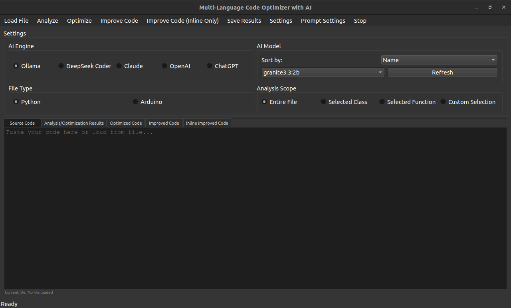

# Code Optimizer with AI
A multi-language code optimizer application with AI integration

## Screenshot


## Features
- Multi-language code optimization
- AI-powered code suggestions
- Support for multiple AI models (Ollama, Claude, OpenAI)
- Real-time progress updates
- Code comparison view

## Code Structure
The application is built using PyQt6 and consists of several key components:

### Main Components
- `CodeOptimizerApp`: The main application class that handles the GUI and user interactions
- `AIWorker`: A QThread-based worker that handles AI model interactions asynchronously
- `CodeEditor`: A custom QTextEdit widget with syntax highlighting support
- `SettingsDialog`: A dialog for managing API keys and other settings

### Key Features Implementation
- **Multi-language Support**: Uses language-specific syntax highlighting and optimization prompts
- **AI Integration**: Supports multiple AI models through a unified interface
- **Real-time Updates**: Implements Qt signals and slots for asynchronous processing
- **Code Comparison**: Uses a split view to show original and optimized code side by side

### Dependencies
- PyQt6: For the graphical user interface
- OpenAI: For GPT model integration
- Anthropic: For Claude model integration
- Transformers: For local model support

## Security
⚠️ **IMPORTANT SECURITY NOTICE** ⚠️

1. **API Keys**
   - Never commit API keys to version control
   - Store API keys in environment variables only
   - Use different API keys for development and production
   - Rotate API keys regularly

2. **Environment Setup**
   ```bash
   # Create a .env file (DO NOT COMMIT THIS FILE)
   echo "ANTHROPIC_API_KEY=your_claude_key" >> .env
   echo "OPENAI_API_KEY=your_openai_key" >> .env
   echo "DEEPSEEK_API_KEY=your_deepseek_key" >> .env
   echo "CHATGPT_API_KEY=your_chatgpt_key" >> .env
   ```

3. **Best Practices**
   - Keep your dependencies updated
   - Use virtual environments
   - Review code changes before committing
   - Report security issues immediately

## Installation
1. Clone the repository
2. Create and activate a virtual environment
3. Install dependencies:
   ```bash
   pip install -r requirements.txt
   ```
4. Set up your API keys in environment variables
5. Run the application:
   ```bash
   python ino-py-optimize-gui.py
   ```
